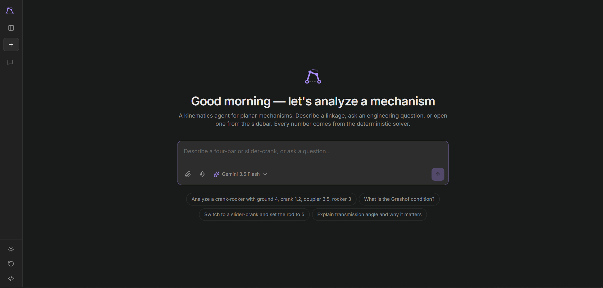
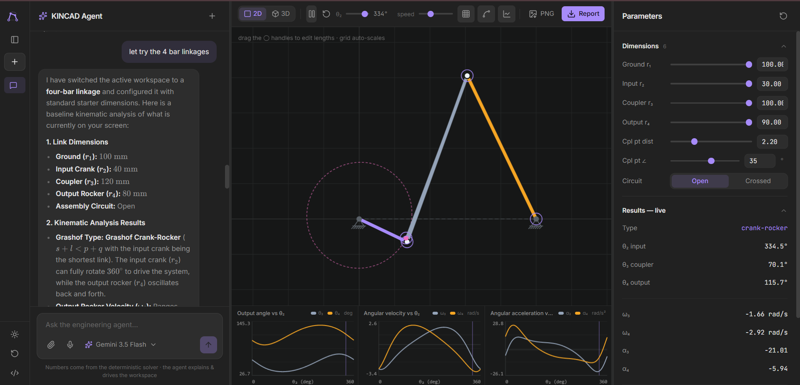
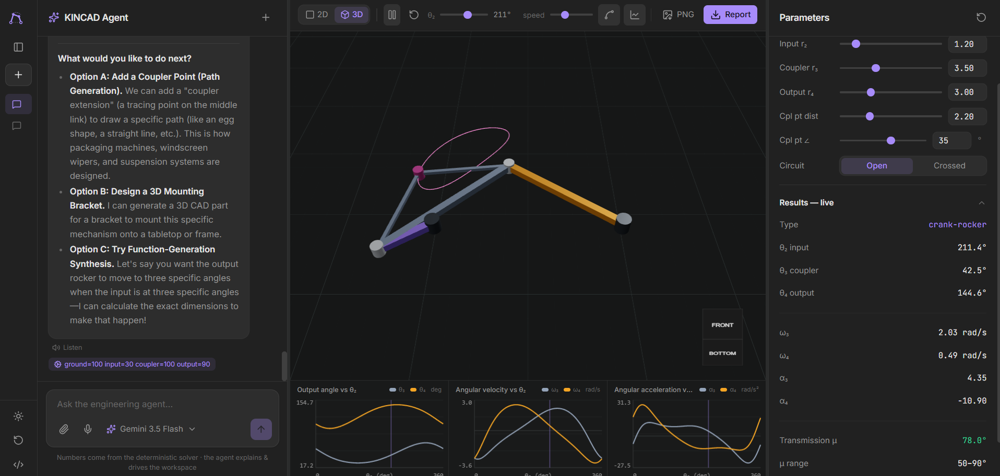
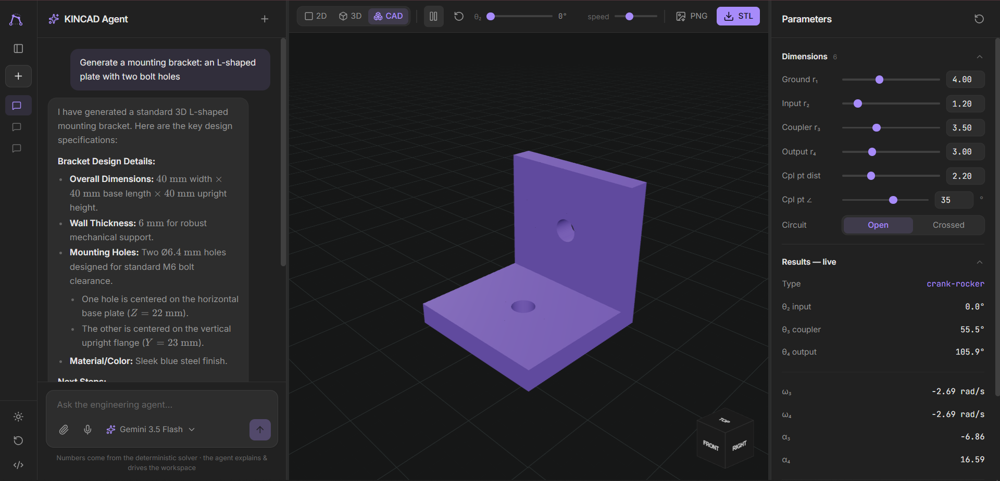

<p align="center">
  
</p>

<h1 align="center">KINCAD</h1>

<p align="center">
  <strong>AI-assisted kinematics workspace for planar mechanism analysis &amp; synthesis</strong><br/>
  Describe a linkage in plain English — the agent builds, animates, and explains it.<br/>
  <em>Every number comes from the deterministic solver, never the language model.</em>
</p>

<p align="center">
  <a href="https://kincad.vercel.app"></a>
  &nbsp;
  
  &nbsp;
  
  &nbsp;
  
  &nbsp;
  
  &nbsp;
  
</p>

---

## Screenshots

<table>
  <tr>
    <td align="center" width="50%">
      <br/>
      <sub><b>2D Workspace</b> — animated four-bar linkage with coupler curve &amp; live kinematic plots</sub>
    </td>
    <td align="center" width="50%">
      <br/>
      <sub><b>3D View</b> — real-time three.js render with coupler-curve trace and orbit controls</sub>
    </td>
  </tr>
  <tr>
    <td align="center" colspan="2">
      <br/>
      <sub><b>Text-to-CAD</b> — describe a 3D part in chat; the agent generates and renders it instantly</sub>
    </td>
  </tr>
</table>

---

## What it does

KINCAD is a browser-based CAD-style workspace that combines a **deterministic kinematics engine** with a multi-model **AI engineering agent**. You describe what you want in the chat; the agent configures the workspace, runs the analysis, and explains the results — while all computed values stay grounded in the solver.

### Key capabilities

| Capability | Details |
|---|---|
| **Mechanism types** | Four-bar linkage · Slider-crank |
| **Kinematic analysis** | Position · velocity · acceleration (closed-form vector-loop / Freudenstein) |
| **Grashof classification** | Crank-rocker · Double-crank · Double-rocker · Change-point · Triple-rocker |
| **Synthesis** | Freudenstein function-generation (3 precision points) |
| **Coupler curves** | Full-cycle tracing, visualised in 2D and 3D |
| **Text-to-CAD** | Agent generates parametric 3D parts (primitives + boolean CSG via three-bvh-csg) |
| **STL export** | Download generated CAD parts for 3D printing or further CAD work |
| **PDF report** | Full analysis report with equations, results, and mechanism diagram |
| **Multi-model AI** | Gemini · Claude · GPT via a key-safe proxy · BYOK · offline fallback |
| **Voice chat** | Mic dictation into composer · read-aloud replies (Web Speech API) |

---

## Quick start

```bash
git clone https://github.com/luca-dynamics/kincad.git
cd kincad
npm install

# Optional — paste whichever API keys you have (BYOK also works in-app)
cp .env.example .env

npm run dev:full          # Vite frontend + AI proxy on http://localhost:5174
```

Without any API keys the **Offline** mode and the full deterministic engine still work.

### Available scripts

| Command | Description |
|---|---|
| `npm run dev:full` | App + AI proxy together (recommended) |
| `npm run dev` | Vite frontend only |
| `npm run server` | AI proxy only (port 8787) |
| `npm test` | Engine + CAD unit tests (Vitest) |
| `npm run build` | Production build |

---

## How it works

```
User prompt
    │
    ▼
AI Agent (Gemini / Claude / GPT / Offline)
    │  interprets intent, emits workspace actions
    ▼
Deterministic Engine (TypeScript)
    │  Freudenstein vector-loop — closed-form position / velocity / acceleration
    ▼
React workspace  ←→  three.js (2D canvas · 3D view · CAD view)
```

The AI **never** invents a kinematic result. It only drives the workspace parameters; the solver computes every angle, velocity, and acceleration from scratch on each frame.

---

## Built with

- **[React 19](https://react.dev)** + **[TypeScript](https://www.typescriptlang.org)** + **[Vite](https://vitejs.dev)**
- **[Tailwind CSS v4](https://tailwindcss.com)**
- **[three.js](https://threejs.org)** / **[@react-three/fiber](https://docs.pmnd.rs/react-three-fiber)** / **[@react-three/drei](https://github.com/pmndrs/drei)**
- **[three-bvh-csg](https://github.com/gkjohnson/three-bvh-csg)** — boolean CSG for text-to-CAD
- **[react-markdown](https://github.com/remarkjs/react-markdown)** + KaTeX — rich chat rendering
- **[Vitest](https://vitest.dev)** — unit tests for the kinematics engine
- **Node.js + [ethers.js](https://docs.ethers.org)** serverless proxy (Vercel functions)

---

## Deployment

See [DEPLOY.md](DEPLOY.md) for full Vercel setup. In short: connect the repo, set `ANTHROPIC_API_KEY`, `OPENAI_API_KEY`, and `GOOGLE_API_KEY` as project environment variables, and deploy. The frontend is static; the AI proxy runs as serverless functions under `/api`.

---

## Design principle

> **The deterministic engine is the single source of truth for every numerical result.**
> The AI assists, explains, and drives the workspace — it never invents numbers.

---

## About

**Mechanical Engineering Final-Year Project**  
Ibidun Quyum Babatunde · `2021/1/82451EM`  
Department of Mechanical Engineering, Federal University of Technology Minna  
Supervised by the Department of Mechanical Engineering, FUT Minna · 2025/26
